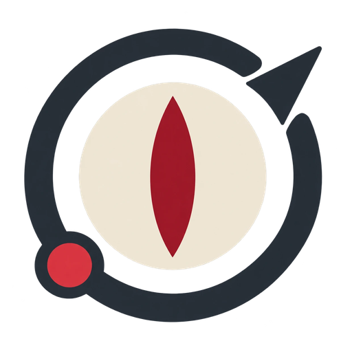
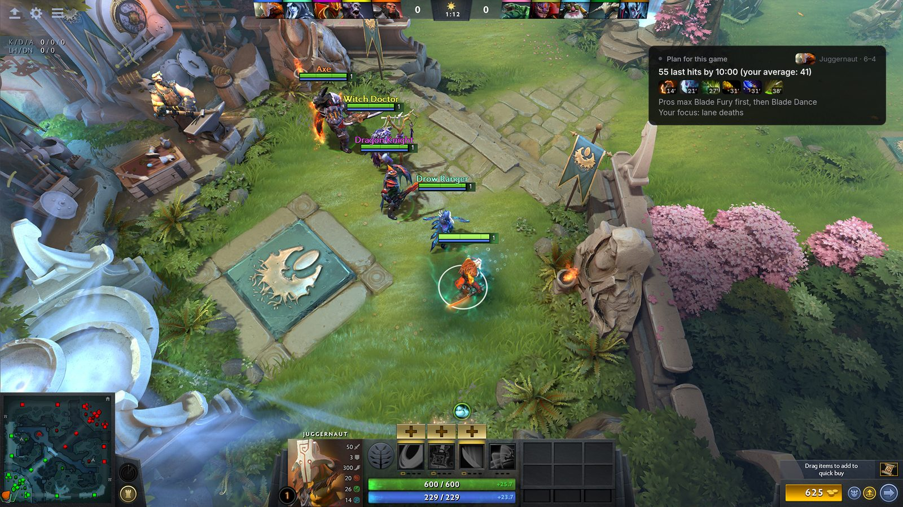
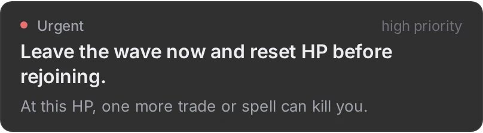
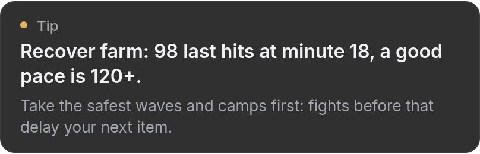
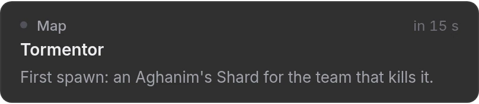
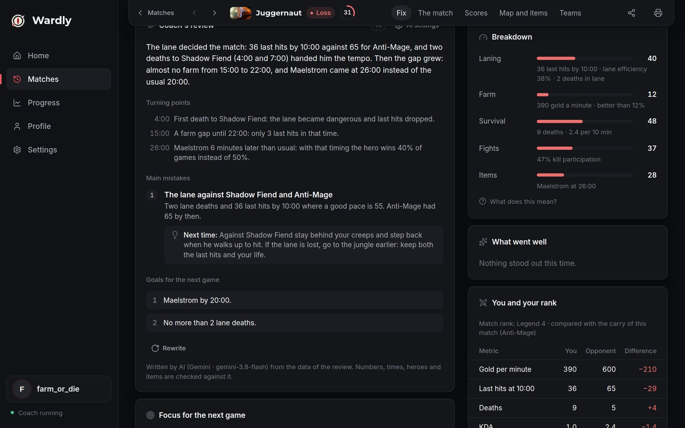
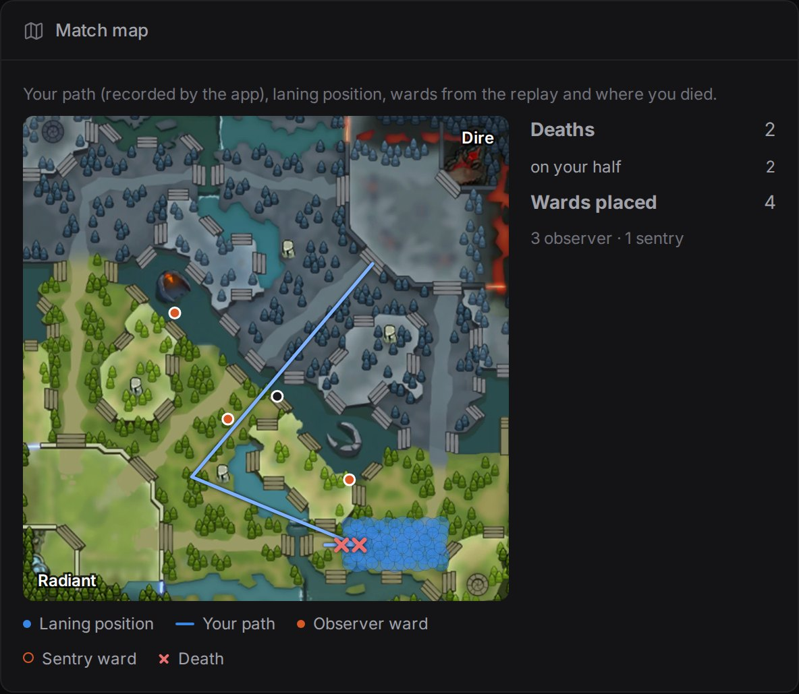
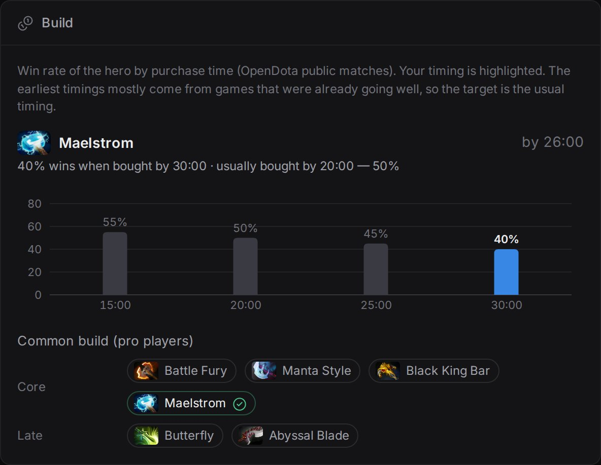
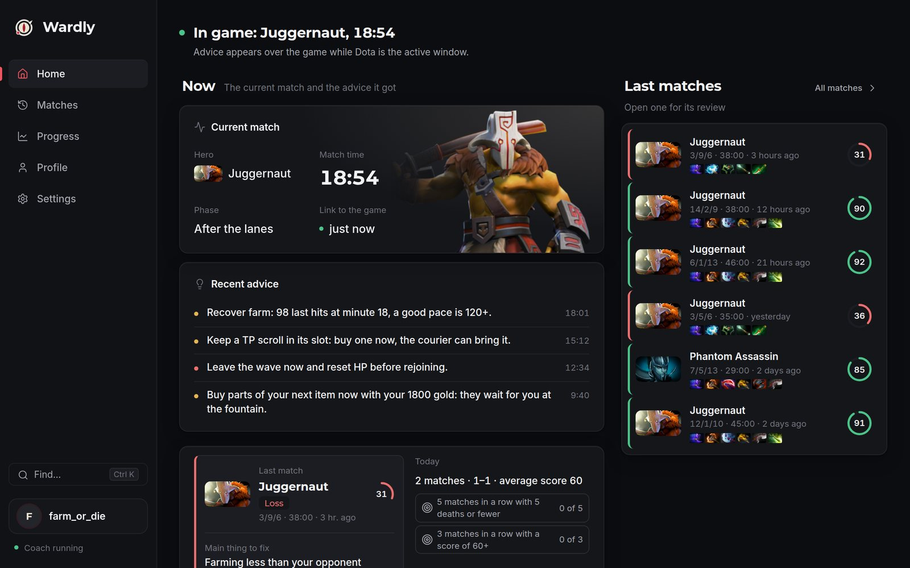

# Wardly

Wardly (formerly Dota AI Coach) is a Dota 2 coach for Windows that watches your game with you: short advice over the game (and out loud) during the match, and an honest review after it — where the farm went, why you died, when your item came, what the player of your rank did. Free, local, open source.

[](https://github.com/makquella/dota-ai-coach/releases/latest)
[](https://github.com/makquella/dota-ai-coach/releases)
[](LICENSE)
[](https://luhovyimvp.dev/en/?ref=github)

**[Download for Windows](https://github.com/makquella/dota-ai-coach/releases/latest)** · [Website](https://luhovyimvp.dev/en/?ref=github) ([українською](https://luhovyimvp.dev/?ref=github)) · [The 64 heroes with full advice](https://luhovyimvp.dev/en/heroes.html?ref=github) · [What's new](https://luhovyimvp.dev/changelog.html) · [Privacy](https://luhovyimvp.dev/privacy.html)

Free, no ads, no subscription, no Overwolf. The installer is not code-signed yet: [VirusTotal report](https://www.virustotal.com/gui/file/e91036b9220b954b5f42c9c42a282a3038bb11aae9ed43d94bc1565802cc0a7d) of 0.18.0 (0 of 67 engines); each release links its own report in its notes.

Live advice comes from deterministic, tested rules on top of Valve's official Game State Integration (no memory reading, no inputs on your behalf). An optional AI coach (free Google Gemini key) writes the post-match review in plain words, and every number, time, hero and item it writes is checked against the match data.



| Low HP | Behind on farm | Map timers |
|---|---|---|
|  |  |  |

| Review with the AI coach | Match map | Build timing |
|---|---|---|
|  |  |  |

## Features

During the match
- Advice card over the game: urgent advice at once, tips with pauses; frequency Less / Normal / More.
- Spoken advice with the Windows voices (heard even in exclusive fullscreen); `Ctrl+Alt+R` repeats the last one.
- The full advisor for 64 heroes: 21 carries, 8 mids, 10 offlaners and 25 supports (farm, items, objectives, the hero's own saves, a farm pace for the position; stacks, pulls, wards and save items for supports); survival advice (low HP, deaths, disables, mana, buyback) for every other hero.
- A plan at the start of each match (until 1:30): last-hit target at 10:00 with your own average, the key item and when most players finish it, your focus.
- Late-game reminders: farm stalls, the pace you should be at, keeping buyback gold; spend spare gold while dead.

After the match
- Score, the three things to fix next game with drills, section meters (laning, farm, survival, fights, items, vision).
- You against the player of your role in the same match; item timings as win rate; draft (your win rate against each enemy, the best pick from your pool, counter items).
- Match map (your path, deaths, wards, laning position), the advice given during the match and deaths right after urgent warnings.
- This match against your usual numbers on the same hero.
- AI coach review (optional, fact-checked) and «Ask the coach»: your own question about the match, answered from its data with the same fact check. PDF export.
- Progress: trends over the last 10 games, recurring problems, heroes at your rank, best vs worst games; filter by hero.
- Focus: pick one recurring problem; every next review says whether you avoided it, Progress keeps the score, the home screen shows tonight's session.
- Turbo, bot games and special modes stay out of the history and trends.

App
- One-click installer, auto-update (never while Dota runs), tray, start with Windows.
- Finds Dota and installs the GSI config itself; checks Steam's saved launch options for `-gamestateintegration` (Dota sends no game data without it) and says how to add it; a first-run checklist shows what is left.
- Match history from the app's own recording plus OpenDota (optional API key for faster sync).
- One-click problem report for bug reports (keys removed).
- Ukrainian and English.
- Hero portraits and item icons (Valve's pictures from Valve's CDN, downloaded once at first use and kept on disk).

## Current Status

The latest version and its changes: [releases](https://github.com/makquella/dota-ai-coach/releases/latest) · [what's new, every version](https://luhovyimvp.dev/changelog.html) ([notes in the repo](docs/release-notes/)).

- FastAPI backend runs locally on `127.0.0.1` (port 8000 by default; the desktop app picks a free port automatically).
- Dota 2 GSI posts live game state to `/gsi`; rule-based recommender and scheduler produce compact advice.
- Electron desktop app (tray, single instance) starts the backend automatically and shows the overlay as its second window.
- Player history, post-match reviews and progress in SQLite; OpenDota enrichment; optional AI coach.
- Replay demo playback works without launching Dota 2; live GSI session recording for validation.
- Backend tests, Node checks and unit tests run in CI; Windows packaging (PyInstaller backend + NSIS installer) is built and smoke-tested on `windows-latest`, and releases publish the auto-update feed.

## Safety Boundaries

The project does not:

- inspect Dota 2 process memory;
- capture or analyze the screen;
- automate keyboard or mouse input;
- inject into Dota 2;
- hook the game process;
- use STRATZ as a live dependency;
- require a database or account system;
- claim unavailable information such as exact enemy positions, team readiness, or exact Roshan/objective state.

Live mode only consumes local HTTP GSI payloads from Dota 2. Replay mode uses offline replay-derived GSI-like states and labels missing or inferred signals explicitly.

## Architecture Overview

High-level flow:

```text
Dota 2 GSI or replay demo
  -> FastAPI backend
  -> state normalizer
  -> decision/recommender layer
  -> advice scheduler
  -> Electron overlay / launcher / session recorder
```

Optional LLM calls can improve text in controlled flows, but local policy still controls:

- `decision_point`
- `priority`
- `time_window`
- safety gating
- anti-spam scheduling

See:

- [Architecture](docs/ARCHITECTURE.md)
- [Advice Scheduler](docs/ADVICE_SCHEDULER.md)
- [Architecture diagram](docs/diagrams/architecture.mmd)
- [GSI pipeline diagram](docs/diagrams/gsi_pipeline.mmd)
- [Scheduler flow diagram](docs/diagrams/scheduler_flow.mmd)

## Quick Start

### Backend

```bash
cd backend
python3 -m venv .venv
source .venv/bin/activate
python -m pip install --require-hashes --only-binary=:all: -r requirements.txt
USE_LLM=false uvicorn app.main:app --reload
```

For tests and linting, install `requirements-dev.txt` with the same flags.
See [Python dependencies](docs/PYTHON_DEPENDENCIES.md) for profiles and lock refresh.

Backend URL:

```text
http://127.0.0.1:8000
```

### Launcher

In another terminal:

```bash
cd frontend/launcher
npm install
npm run dev
```

The launcher is the whole desktop app: it starts the backend automatically (hidden, on a free local port — 8000 when it is free), shows the always-on-top advice overlay as its second window, and keeps running in the system tray when its window is closed. Tray menu: Open, Overlay on/off, Start with Windows, Quit. Quitting stops the backend gracefully.

Because the launcher runs its own backend, you do not need the manual `uvicorn` step above when using it.

On Windows, install the app with the NSIS installer built by `scripts\build-windows.ps1` (see [Windows Packaging](docs/PACKAGING_WINDOWS.md)).



### Overlay


The overlay is a transparent, click-through window of the launcher. It is on screen only while Dota 2 is running, is the active window, and a match is sending fresh GSI data; alt-tab, minimizing Dota or going back to the menu hides it (replay demo and unlocked positioning mode show it anyway). The tray shows the state: *Dota not found* / *Waiting for game* / *In game* (in the app language: Ukrainian or English). On first run the app finds Dota through Steam (registry + `libraryfolders.vdf`, any drive) and installs the GSI config itself. It polls `/overlay/recommendation` on the backend port chosen by the launcher. Hotkeys: `Ctrl+Alt+O` toggle, `Ctrl+Alt+M` mute 5 min, `Ctrl+Alt+R` repeat the last advice (shown and spoken again), `Ctrl+Alt+L` lock/unlock dragging, `Ctrl+Alt+1/2/3` left / right / bottom position (all clear of the minimap and hero panel), `Ctrl+Alt+D` debug line.

### Replay demo without Dota 2

The launcher's demo mode replays a recorded match through the normal backend and overlay path (the backend still produces the advice). Commands: [Replay Demo](docs/REPLAY_DEMO.md), [Quickstart](docs/QUICKSTART.md), [Reference Commands](docs/REFERENCE_COMMANDS.md).

## Testing

```bash
# from the repository root, with the backend venv
python scripts/dev.py check --changed --dry-run   # what would run for your changes
python scripts/dev.py check --full                # backend, launcher, Worker, site and version checks
```

Per part: `cd backend && python -m pytest`; `cd frontend/launcher && npm run check && npm test`;
`cd services/api && npm test`. Details: [Testing](docs/TESTING.md), [Dev runner](docs/DEV_RUNNER.md).

## Documentation Links

- [Quickstart](docs/QUICKSTART.md)
- [Architecture](docs/ARCHITECTURE.md)
- [Replay Demo](docs/REPLAY_DEMO.md)
- [Reference Commands](docs/REFERENCE_COMMANDS.md)
- [Roadmap](docs/ROADMAP.md)
- [Advice Scheduler](docs/ADVICE_SCHEDULER.md)
- [Windows Packaging](docs/PACKAGING_WINDOWS.md)
- [Replay Tools README](backend/replay_tools/README.md)

Diagrams:

- [Architecture Mermaid](docs/diagrams/architecture.mmd)
- [GSI Pipeline Mermaid](docs/diagrams/gsi_pipeline.mmd)
- [Scheduler Flow Mermaid](docs/diagrams/scheduler_flow.mmd)

## Limitations

- GSI does not provide exact enemy positions, nearby unit counts, exact teamfight context, or exact team readiness.
- Replay-derived GSI-like states are not identical to live GSI.
- The minimal replay parser does not currently extract exact spendable gold or ability cooldowns.
- Advice is intentionally conservative when required signals are missing.
- Optional LLM usage is not required for live mode and is best treated as wording/review support.
- The Windows build is unsigned until SignPath Foundation approves it (SmartScreen may warn on first run).

## Code signing policy

Free code signing provided by [SignPath.io](https://signpath.io), certificate by [SignPath Foundation](https://signpath.org).
The application to SignPath Foundation is submitted; until it is approved, the Windows installer is unsigned.

- **What is signed:** only the Wardly installer and the app inside it, built by GitHub Actions
  ([`release.yml`](.github/workflows/release.yml)) from this repository's source. Every signing request is approved manually.
- **Committers and reviewers:** [makquella](https://github.com/makquella). Pull requests from anyone else are reviewed before merge.
- **Approvers:** [makquella](https://github.com/makquella) (repository owner).
- **Privacy policy:** [luhovyimvp.dev/privacy.html](https://luhovyimvp.dev/privacy.html) — what the app sends, to which
  services (OpenDota, Valve CDN, GitHub, optional AI services; problem reports and anonymous statistics only with consent)
  and how to turn it off.

The same policy on the website: [luhovyimvp.dev/code-signing.html](https://luhovyimvp.dev/code-signing.html).

## License / Authorship

- Author: Artem / makquella
- Year: 2026
- License: MIT, see [LICENSE](LICENSE)

Dota 2 is a Valve game. This project is not affiliated with Valve.
