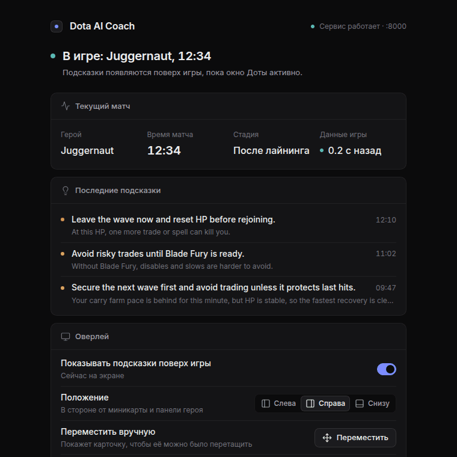
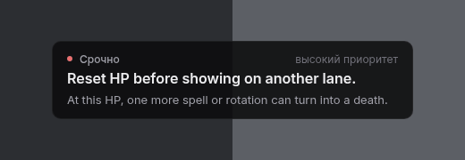

# Dota AI Coach

Dota AI Coach is a coursework MVP for a real-time Dota 2 carry coach. It receives live Dota 2 Game State Integration (GSI) updates, normalizes the state, applies deterministic coaching rules, filters advice through an anti-spam scheduler, and shows compact guidance in an always-on-top overlay window of the Electron desktop app.

The project is intentionally conservative. The local rule-based policy is authoritative for live advice. Optional LLM support is used only for wording and offline review workflows, not for overriding safety priority or timing.

## Current Status

**Coursework MVP / v0.1.0**

The current version is ready for coursework defense and local demonstration:

- FastAPI backend runs locally on `127.0.0.1` (port 8000 by default; the desktop app picks a free port automatically).
- Dota 2 GSI can post live game state to `/gsi`.
- Rule-based recommender and scheduler produce compact carry advice.
- Electron desktop app (tray, single instance) starts the backend automatically and shows the overlay as its second window.
- The overlay displays one small always-on-top advice card.
- Replay demo playback works without launching Dota 2.
- Live GSI session recording works for validation and post-session review.
- Backend tests and Node syntax checks are available.
- Windows live GSI validation was completed in Dota 2 Demo Hero mode.
- Windows packaging: one command (`scripts\build-windows.ps1`) builds the PyInstaller backend, the Electron app and an NSIS installer; CI builds it on `windows-latest` and smoke-tests `/health`.

## What Is Implemented

Backend:

- FastAPI app and local-only endpoints.
- Live Dota 2 GSI endpoint.
- GSI state normalization.
- Demo replay-state endpoint.
- Deterministic decision points and fallback wording.
- Advice scheduler with duplicate suppression, game-time spacing, active-card handling, and heartbeat long-silence nudges.
- Data-driven hero profiles and hero safety checks.
- Laning Coach v1.
- Post-Laning Farming Coach v1.
- Signal capability metadata for live GSI, replay-derived states, OpenDota imports, and synthetic samples.
- Live GSI session recorder.
- Coach session summary builder.
- Offline replay conversion and simulation scripts.
- Optional LLM providers for wording/review flows.

Frontend:

- Electron launcher for coursework defense.
- Electron desktop overlay for compact advice.
- Legacy `frontend/overlay.html` browser overlay kept as debug/fallback.
- Replay demo presets for Phantom Lancer and Juggernaut.
- Clean/verbose launcher logs for defense and debugging.

Evaluation:

- Offline replay-derived GSI-like simulations.
- Replay evaluation summaries for laning, post-laning, and macro/farming windows.
- LLM-vs-fallback comparison utilities.
- Pytest coverage for core backend behavior.
- Windows live GSI test evidence from Dota 2 Demo Hero mode.

## Safety Boundaries

The project does not:

- inspect Dota 2 process memory;
- capture or analyze the screen;
- automate keyboard or mouse input;
- inject into Dota 2;
- hook the game process;
- use STRATZ as a live dependency;
- require a database or account system;
- claim unavailable information such as exact enemy positions, team readiness, or exact Roshan/objective state.

Live mode only consumes local HTTP GSI payloads from Dota 2. Replay mode uses offline replay-derived GSI-like states and labels missing or inferred signals explicitly.

## Architecture Overview

High-level flow:

```text
Dota 2 GSI or replay demo
  -> FastAPI backend
  -> state normalizer
  -> decision/recommender layer
  -> advice scheduler
  -> Electron overlay / launcher / session recorder
```

Optional LLM calls can improve text in controlled flows, but local policy still controls:

- `decision_point`
- `priority`
- `time_window`
- safety gating
- anti-spam scheduling

See:

- [Architecture](docs/ARCHITECTURE.md)
- [Advice Scheduler](docs/ADVICE_SCHEDULER.md)
- [Architecture diagram](docs/diagrams/architecture.mmd)
- [GSI pipeline diagram](docs/diagrams/gsi_pipeline.mmd)
- [Scheduler flow diagram](docs/diagrams/scheduler_flow.mmd)

## Quick Start

### Backend

```bash
cd backend
python3 -m venv .venv
source .venv/bin/activate
pip install -r requirements.txt
USE_LLM=false uvicorn app.main:app --reload
```

Backend URL:

```text
http://127.0.0.1:8000
```

### Launcher

In another terminal:

```bash
cd frontend/launcher
npm install
npm run dev
```

The launcher is the whole desktop app: it starts the backend automatically (hidden, on a free local port — 8000 when it is free), shows the always-on-top advice overlay as its second window, and keeps running in the system tray when its window is closed. Tray menu: Open, Overlay on/off, Start with Windows, Quit. Quitting stops the backend gracefully.

Because the launcher runs its own backend, you do not need the manual `uvicorn` step above when using it.

On Windows, install the app with the NSIS installer built by `scripts\build-windows.ps1` (see [Windows Packaging](docs/PACKAGING_WINDOWS.md)).



### Overlay



The overlay is a transparent, click-through window of the launcher. It is on screen only while Dota 2 is running, is the active window, and a match is sending fresh GSI data; alt-tab, minimizing Dota or going back to the menu hides it (replay demo and unlocked positioning mode show it anyway). The tray shows the state: *Dota not found* / *Waiting for game* / *In game* (Russian on a Russian system). On first run the app finds Dota through Steam (registry + `libraryfolders.vdf`, any drive) and installs the GSI config itself. It polls `/overlay/recommendation` on the backend port chosen by the launcher. Hotkeys: `Ctrl+Alt+O` toggle, `Ctrl+Alt+M` mute 5 min, `Ctrl+Alt+L` lock/unlock dragging, `Ctrl+Alt+1/2/3` left / right / bottom position (all clear of the minimap and hero panel), `Ctrl+Alt+D` debug line.

### Defense Demo Without Dota 2

Recommended stable demo:

```bash
cd backend
source .venv/bin/activate
SIMULATION_USE_LLM=false \
python3 scripts/run_overlay_demo.py \
  --simulation-file ../data/match_simulations/replay_gsi_like_match_8843382732_pl_20_30.jsonl \
  --speed 5 \
  --advice-hold-seconds 8 \
  --export-summary simulation_results/demo_session_summary_pl_20_30.md \
  --export-summary-json simulation_results/demo_session_summary_pl_20_30.json
```

This replays a Phantom Lancer 20-30 minute macro/farming slice into the normal backend and overlay path. It is not fake UI text; the backend still produces the advice.

More commands:

- [Quickstart](docs/QUICKSTART.md)
- [Replay Demo](docs/REPLAY_DEMO.md)
- [Reference Commands](docs/REFERENCE_COMMANDS.md)

## Live GSI Test Summary

A live Windows validation was completed in Dota 2 Demo Hero mode.

Summary:

- Environment: Windows 11, Dota 2 Demo Hero
- Mode: `live_gsi`
- Hero: Juggernaut
- Session: `live_session_20260610T090212_534960_0000`
- Raw GSI states: `165`
- Shown advice cards: `6`
- Approximate game-time range: `299-488` seconds
- Advice categories:
  - `LOW_HP`
  - `LOW_MANA`
  - `HERO_SURVIVABILITY_RISK`
  - `ABILITY_SAFETY_COOLDOWN`

Validated pipeline:

```text
Dota 2 -> GSI config -> FastAPI backend -> state parser -> recommender/scheduler -> recorder -> shown_advice.jsonl
```

Full sanitized report:

- [Live GSI Test Report](docs/LIVE_GSI_TEST_REPORT.md)

## Replay Demo Summary

Replay demos use existing GSI-like JSONL files in:

```text
data/match_simulations/
```

Primary launcher demo files:

- `replay_gsi_like_match_8843382732_pl_20_30.jsonl`
- `replay_gsi_like_match_8843471434_jugg_10_20.jsonl`

These demos are useful for coursework defense because they do not require Dota 2 to be running. They still exercise the backend, scheduler, overlay polling, and session summary path.

Details:

- [Replay Demo](docs/REPLAY_DEMO.md)
- [Replay Evaluation Summary](backend/simulation_results/replay_evaluation_summary_20260608.md)

## Testing

Backend:

```bash
cd backend
source .venv/bin/activate
pytest -q
python3 -m compileall -q app scripts packaging tests
```

Frontend syntax checks:

```bash
# from repository root
node --check frontend/launcher/main.js
node --check frontend/launcher/preload.js
node --check frontend/launcher/settings.js
node --check frontend/launcher/overlay-window.js
node --check frontend/launcher/overlay-placement.js
node --check frontend/launcher/overlay-preload.js
node --check frontend/launcher/overlay-visibility.js
node --check frontend/launcher/dota-watcher.js
node --check frontend/launcher/steam-locator.js
node --check frontend/launcher/updater.js
node --check frontend/launcher/renderer/app.js
node --check frontend/launcher/renderer/charts.js
node --check frontend/launcher/renderer/matches.js
node --check frontend/launcher/overlay/app.js
node --check frontend/launcher/assets/icons/lucide.js
(cd frontend/launcher && npm test)   # node --test, no dependencies
```

Repository hygiene:

```bash
git diff --check
```

## Documentation Links

- [Quickstart](docs/QUICKSTART.md)
- [Architecture](docs/ARCHITECTURE.md)
- [Replay Demo](docs/REPLAY_DEMO.md)
- [Analogues and Differentiation](docs/ANALOGS.md)
- [Live GSI Test Report](docs/LIVE_GSI_TEST_REPORT.md)
- [Reference Commands](docs/REFERENCE_COMMANDS.md)
- [Roadmap](docs/ROADMAP.md)
- [Advice Scheduler](docs/ADVICE_SCHEDULER.md)
- [Windows Packaging](docs/PACKAGING_WINDOWS.md)
- [Replay Tools README](backend/replay_tools/README.md)

Diagrams:

- [Architecture Mermaid](docs/diagrams/architecture.mmd)
- [GSI Pipeline Mermaid](docs/diagrams/gsi_pipeline.mmd)
- [Scheduler Flow Mermaid](docs/diagrams/scheduler_flow.mmd)

## Limitations

- GSI does not provide exact enemy positions, nearby unit counts, exact teamfight context, or exact team readiness.
- Replay-derived GSI-like states are not identical to live GSI.
- The minimal replay parser does not currently extract exact spendable gold or ability cooldowns.
- Advice is intentionally conservative when required signals are missing.
- Optional LLM usage is not required for live mode and is best treated as wording/review support.
- The Windows build is unsigned (SmartScreen may warn on first run).

## Roadmap / Future Work

Current status:

- Coursework MVP / v0.1.0.

Implemented:

- FastAPI backend.
- Dota 2 GSI endpoint.
- Rule-based recommender.
- Advice scheduler / anti-spam.
- Game-time spacing.
- Heartbeat long-silence nudge.
- Electron launcher.
- Electron overlay.
- Replay demo playback.
- Live GSI recorder.
- Windows live GSI validation.
- Tests.

Future work:

- Code-sign the Windows installer.
- Run longer real-match validation beyond demo-hero testing.
- Expand hero-specific safety rules and profiles.
- Add optional semantic review/RAG mode for post-session analysis.
- Add optional offline OpenDota/OpenDota-like replay enrichment.
- Polish launcher and overlay UI.

See the detailed roadmap:

- [Roadmap](docs/ROADMAP.md)

## License / Authorship

- Author: Artem / makquella
- Project: Dota AI Coach coursework MVP
- Year: 2026
- License: MIT, see [LICENSE](LICENSE)

Dota 2 is a Valve game. This educational project is not affiliated with Valve.
